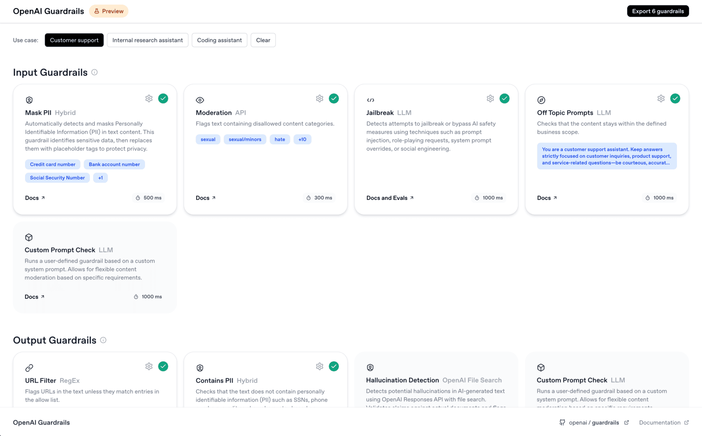

# Guardrails

**Guardrails** is a safety framework for LLM applications that automatically validates inputs and outputs using configurable checks. Use the [Guardrails Wizard](https://guardrails-vercel-git-main-openai.vercel.app/guardrails) to create configurations, then drop in our client classes for automatic validation.



## Why Guardrails

- **Drop-in replacement** for OpenAI clients with automatic validation
- **No-code configuration** via the Guardrails Wizard
- **Pipeline-based** validation across input, output, and pre-flight stages
- **Production ready** for real-world LLM applications

## How It Works

1. **Configure**: Use the Wizard or define pipeline configurations
2. **Replace**: Use `GuardrailsAsyncOpenAI` instead of `AsyncOpenAI`
3. **Validate**: Guardrails run automatically on every API call
4. **Handle**: Access results via `response.guardrail_results`

## Built-in Guardrails

- **Content Safety**: Moderation, jailbreak detection
- **Data Protection**: PII detection, URL filtering  
- **Content Quality**: Hallucination detection, off topic prompts

## Quickstart

```python
from guardrails import GuardrailsAsyncOpenAI

client = GuardrailsAsyncOpenAI(config="guardrails_config.json")
response = await client.responses.create(
    model="gpt-5",
    input="Hello"
)
# Guardrails run automatically
print(response.llm_response.output_text)
```

## Next Steps

- [Quickstart](./quickstart.md) - Full quickstart guide
- [Examples](./examples.md) - See real implementations
- [Guardrails Wizard](https://guardrails-vercel-git-main-openai.vercel.app/guardrails) - Create configurations visually

## Disclaimers

Please note that Guardrails may use Third-Party Services such as the [Presidio open-source framework](https://github.com/microsoft/presidio), which are subject to their own terms and conditions and are not developed or verified by OpenAI.

Developers are responsible for implementing appropriate safeguards to prevent storage or misuse of sensitive or prohibited content (including but not limited to personal data, child sexual abuse material, or other illegal content). OpenAI disclaims liability for any logging or retention of such content by developers. Developers must ensure their systems comply with all applicable data protection and content safety laws, and should avoid persisting any blocked content generated or intercepted by Guardrails.
