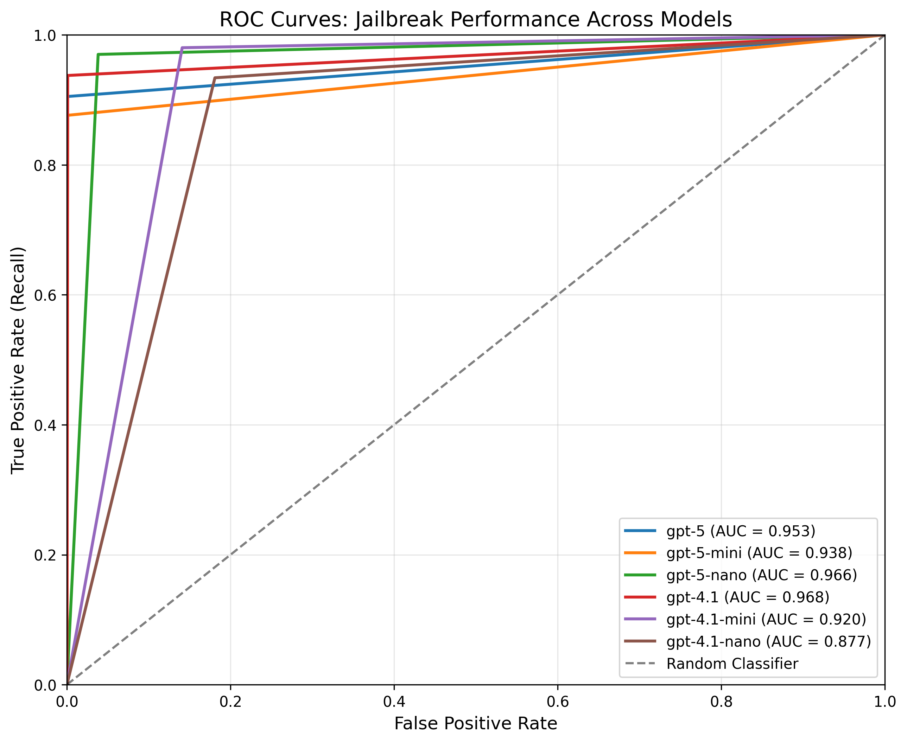

# Jailbreak Detection

Identifies attempts to bypass AI safety measures such as prompt injection, role-playing requests, or social engineering attempts. Analyzes text for jailbreak attempts using LLM-based detection, identifies various attack patterns, and provides confidence scores for detected attempts.

## Configuration

```json
{
    "name": "Jailbreak",
    "config": {
        "model": "gpt-4.1-mini",
        "confidence_threshold": 0.7
    }
}
```

### Parameters

- **`model`** (required): Model to use for detection (e.g., "gpt-4.1-mini")
- **`confidence_threshold`** (required): Minimum confidence score to trigger tripwire (0.0 to 1.0)

## What It Returns

Returns a `GuardrailResult` with the following `info` dictionary:

```json
{
    "guardrail_name": "Jailbreak",
    "flagged": true,
    "confidence": 0.85,
    "threshold": 0.7,
    "checked_text": "Original input text"
}
```

- **`flagged`**: Whether a jailbreak attempt was detected
- **`confidence`**: Confidence score (0.0 to 1.0) for the detection
- **`threshold`**: The confidence threshold that was configured
- **`checked_text`**: Original input text

## Benchmark Results

### Dataset Description

This benchmark evaluates model performance on a diverse set of prompts:

- **Subset of the open source jailbreak dataset [JailbreakV-28k](https://huggingface.co/datasets/JailbreakV-28K/JailBreakV-28k)** (n=2,000)
- **Synthetic prompts** covering a diverse range of benign topics (n=1,000)
- **Open source [Toxicity](https://github.com/surge-ai/toxicity/blob/main/toxicity_en.csv) dataset** containing harmful content that does not involve jailbreak attempts (n=1,000)

**Total n = 4,000; positive class prevalence = 2,000 (50.0%)**

### Results

#### ROC Curve



#### Metrics Table

| Model         | ROC AUC | Prec@R=0.80 | Prec@R=0.90 | Prec@R=0.95 | Recall@FPR=0.01 |
|--------------|---------|-------------|-------------|-------------|-----------------|
| gpt-5         | 0.979   | 0.973       | 0.970       | 0.970       | 0.733           |
| gpt-5-mini    | 0.954   | 0.990       | 0.900       | 0.900       | 0.768           |
| gpt-5-nano    | 0.962   | 0.973       | 0.967       | 0.965       | 0.048           |
| gpt-4.1       | 0.990   | 1.000       | 1.000       | 0.984       | 0.946           |
| gpt-4.1-mini (default) | 0.982   | 0.992       | 0.992       | 0.954       | 0.444           |
| gpt-4.1-nano  | 0.934   | 0.924       | 0.924       | 0.848       | 0.000           |

#### Latency Performance

| Model         | TTC P50 (ms) | TTC P95 (ms) |
|--------------|--------------|--------------|
| gpt-5         | 4,569        | 7,256        |
| gpt-5-mini    | 5,019        | 9,212        |
| gpt-5-nano    | 4,702        | 6,739        |
| gpt-4.1       | 841          | 1,861        |
| gpt-4.1-mini  | 749          | 1,291        |
| gpt-4.1-nano  | 683          | 890          |

**Notes:**

- ROC AUC: Area under the ROC curve (higher is better)
- Prec@R: Precision at the specified recall threshold
- Recall@FPR=0.01: Recall when the false positive rate is 1%
- TTC: Time to Complete (total latency for full response)
- P50/P95: 50th and 95th percentile latencies
